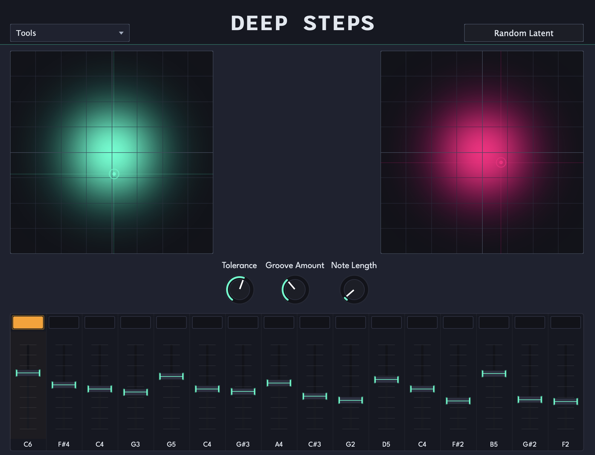

# Deep Steps DAW Plugin

## Introduction

Deep Steps is a generative MIDI sequencer driven by user-trainable neural networks.
This is a re-implementation using the JUCE C++ framework as a DAW plugin and Torch for neural networks and machine learning.

The original Deep Steps project can be found [here](https://github.com/ajwast/DeepSteps). It was created by Alex Wastnidge as part of their Master's thesis for the Music, Communication and Technology programme at the University of Oslo. It's development was presented at the [* International Conference on AI and Musical Creativity 2024*](https://aimc2024.pubpub.org/pub/odrhfynm/release/1)

This plugin implementation is very much ***in development***. See the status of the project and the "To dos" below.

## What's New?

The DAW plugin (re)implementation makes several key improvements on the original project:

### DAW MIDI Step Sequencer Plugin
- Implemented as DAW plugin
- Pure C++ implementation with JUCE framework and Torch (libtorch)
- Sample-accurate MIDI timing and synchronisation with DAW.
- Custom JUCE GUI
- All functionality implemented in-plugin, including model training.
- Many instances of plugin can run at once.

### Step Generation Neural Network
- RAE-L2 neural network architecture ([Ghosh et al.](https://arxiv.org/abs/1903.12436)) is used for step generation.
- Ex-Post Density Estimation allows actual data distribution within latent space to be used and visualised in X/Y pad heatmaps.
- Batch normalisation used as in [Ghose, A., Rashwan, A. &amp; Poupart, P.. (2020). Batch norm with entropic regularization turns deterministic autoencoders into generative models. <i>Proceedings of the 36th Conference on Uncertainty in Artificial Intelligence (UAI)</i>, in <i>Proceedings of Machine Learning Research</i>](https://proceedings.mlr.press/v124/ghose20a.html) 
- Tahn function on the decoder output to cheaply clip range between -1 and 1.

### Groove Generation 
- Micro-timings for groove is driven by a Gaussian regression model which takes the current step generation as input.
- "Groove" is a continuous timing offset of a 16th note between its neighboring 32nd notes.
- Groove offsets are re-sampled from Gaussian distribution every bar to mimic human playing.

### User Training Data
- Re-implemented onset detection from scratch with spectral flux and peak picking.
- Saving and loading of training data

## To Do
- Release build of VST3
- GUI controls over training hyperparameters: epoches, 
- Add model weights as part of the Value Tree State (APVTS) for model recall.
- Presets implementation: saving and recall of entire plugin state
- Documentation (any)
- Auto-validation testing using [pluginval](https://github.com/Tracktion/pluginval)
- AU, AAX, LV2, CLAP support
- User-trainable recurrent neural network for pitch generation

## Installation

Check the Releases page for current pre-built plugins

### Building from source
To build the plugin yourself you will need:

- JUCE C++ framework
- Libtorch C++
- CMake
- An IDE (CLion, VSCode, Xcode etc.)

Create your own *CMakeLists.txt* file using the example file. Change the paths to JUCE and libtorch to your own directories and build the project.

